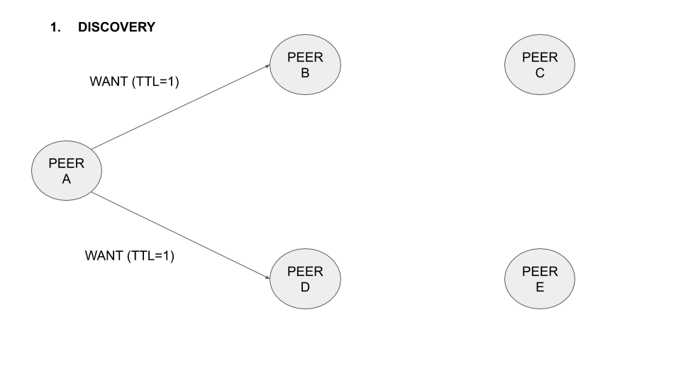

#  RFC|BB|L1-02: TTLs for rebroadcasting WANT messages
* Status: `Draft`
* Implementation here: https://github.com/adlrocha/go-bitswap/tree/feature/rfcBBL102

## Abstract

This RFC proposes setting a TTL on Bitswap WANT messages and TTL ceiling per node, in order to increase the chance of a node finding a provider that has the content without resorting to the DHT. 

<!-- Full description here: https://docs.google.com/document/d/1zjJCZel8zJzgK3XuHK0YZlNffEHThq7tUOssGgRTryY/edit#heading=h.6qnrq913vou6 -->

## Shortcomings

Bitswap only sends WANT messages to its directly connected peers. This limits the potential for finding the peer with the content to the peers directly connected to or the ones that result from a DHT query, which has its cost in time and connectivity.

## Description

The idea is to include a TTL to WANT messages. That way instead of forwarding WANT messages to our directly connected peers, we can increase the scope to, for instance, the connected peers of our connected peers (TTL=1). With this, we increase the span of discovery of content without having to resort to the DHT. This TTL needs to be limited to a small number to avoid flooding the network with WANT requests. It also complicates the implementation of the protocol, as now nodes need to track not only sessions from their directly connected peers but also from the ones x-hops away from them. Several design decisions would have to be made in the implementation such as the following (ideally the best value for these fields will be determined in testing. Additionally, we could set them to be dynamic according to the state of the network or the developer's desire. This will be explored in the future work).

-   Max TTL allowed. [This study proves](http://conferences2.sigcomm.org/acm-icn/2015/proceedings/p9-wang.pdf) that a Max TTL = 2 achieves the best performance (for moderately popular content) without severe impact in latency, so we can consider this as the baseline value. However, The impact and performance of this will depend heavily on how many connections each node maintains.

-   Forwarder of discovered blocks: Nodes x-hops away from the source of the requests can send responses following two approaches:

    -   Symmetric routing: Messages are forwarded to the requestor following the same path followed by the WANT messages.

    -   Asymmetric routing: Messages do not follow the same path followed by the WANT message, and responses are directly forwarded to its original requestor. In this alternative, nodes follow a "fire-and-forget approach" where intermediate nodes only act as relays and don't track the status of sessions, the receiving node X-hops away answer the requestor node directly, and the only one tracking the state of the session is the originating peer (and maybe the directly connected peers while the session has not been canceled, so that if they see any of the requested blocks it can notify its discovery). When implementing this approach we have to also bear in mind that establishing connections is an expensive process so in order for this approach to be efficient we should evaluate when it is worth for nodes to open a dedicated connection to forward messages back to the original requestor. This does mean that the WANT messages need to have an additional field of “requester” so that the receiving node knows who to dial to deliver a block.

Initially, the protocol will be designed using symmetric routing, and will explore other routing alternatives in the future work. When exploring symmetric routing we need to bear in mind that according to IPFS values, nodes shouldn't push content to other peers that haven't requested it.

Again, this proposal should include schemes to avoid flooding attacks and the forgery of responses. It may be sensible to include networking information also in the request to allow easy discovery to forward responses X-hop away.

## Implementation plan
- [X] Include TTL in WANT messages. Nodes receiving the WANT message track the session using relay sessions, reduce in one the TTL of the WANT message and forward it to its connected peers. Duplicate WANT messages with lower or equal TTL should be discarded to avoid loops (higher TTLs could represent request updates). WANT sessions should be identified at least with the following tuple: {SOURCE, WANT_ID} so nodes know to whom it needs to send discovered blocks. (See figures below for the proposed implementation of the symmetric approach).

- [X] Test the performance and bandwidth overhead of this scheme compared to plain Bitswap for different values of TTL.

- [ ] Evaluate the use of a symmetric and asymmetric routing approach for the forwarding of discovered blocks.

- [ ] Consider the implementation of "smart TTLs" in WANT requests, so according to the status of the network, bandwidth available, requests alive, number of connections or any other useful value, the TTL is determined.

## Implementation details
### Basic implementation
* An additional TTL field has been added to Bitswap WANT entries in Bitswap messages to
enable the forwarding of exchange requests to peers TTL+1 hops away.
* Bitswap is set with a defualt TTL of 1, so corresponding messages will only be forwarded
to nodes two hops away.
* Sessions now include a TTL parameter to determine how far their WANT messages can go. Sessions started within the peer (because the peer wants a block) are considered `direct`, while the ones triggered from the reception of a WANT mesages with enough TTLs are referred as `relay` (the peer is doing the work on behalf of another peer and it is not explicitly interested in the block). An `indirect` flag has also been added to sessions in case in the future a different strategy want
to be implemented for relay sessions (like the use of a degree to limit the number of WANT messages broadcasted to connected nodes to prevent flooding the network). Currently direct and relay sessions follow the exact same strategy for block discovery and transmission.

* All the logic around relay sessions is done in `engine.go`, `session.go`, `peerwantmanager.go`:
    - Whenever a peer receives a WANT message from which it doesn't have the block and its TTL is not zero, it sends a DONT_HAVE right away, and it tells the relay session to start a discovery for those WANT messages with TTL-1.
    - Whenever a new block or HAVE messages are received in an intermediate node for an active relay session, these messages are forwarded to the source (the initial requester). This action updates the DONT_HAVE status of the intermediate node so it is again included in the session. 
        - _We need to be careful, in the current implementation blocks from relay sessions are stored in the datastore for convenience, but they should be removed once all the interested relay sessions for the block are closed and they have been successfully forwarded to avoid peers storing content they didn't explicitly requested._
    - When receiving a HAVE the relay session will automatically send the WANT-BLOCK to the corresponding peers, we have identified the interest from every peer (including direct ones) so when a peer receives a block for an relay file it will automatically forward it to the source (there is no need to forward interest for WANT-BLOCKS because this is automatically managed withing the relay sessions). Relay sessions work in the same as direct sessions in this first implementation.

### Symmetric approach message flows

# Impact
We should expect a latency reduction in the discovery of content but it may lead to an increase in the bandwidth overhead of the protocol. We do not expect the increase in the bandwidth overhead to be substantial, given that response messages are not big in size

## Evaluation Plan
-  [ ] [The IPFS File Transfer benchmarks.](https://docs.google.com/document/d/1LYs3WDCwpkrBdfrnB_LE0xsxdMCIhXdCchIkbzZc8OE/edit#heading=h.nxkc23tlbqhl)
    - To evaluate the performance of this RFC we need a network where the `MAX_CONNECTION_RATE` of nodes is small, the number of passive nodes in the network (neither seeding nor leeching content) is high, and the number of seeders providing the content small. This will force content to be several hops away from leechers. Leechers should request the content all at the same time (if done in waves leechers in a wave would become seeders in the next wave and may add noise to the measurement).

- [ ] An additional measurement to consider is to compare the times a node needs to resort to the DHT to find the content in plain Bitswap compared to the RFC (this would determine how effective the strategy is). 

## Prior Work
This RFC was inspired by this proposal. The RFC is based on the assumption that DHT lookups are slow and therefore is better to increase our “Bitswap span” than resorting to the DHT. It would be great if we could validate this assumption before considering its implementation.

## Results
TBA

## Future Work
Some future work lines to consider:

-   Combine with RFC|BB|L1-04 so apart from setting a TTL to WANT messages, every peer receiving a WANT message tracks it in its peer-block registry enhancing also the discovery scope with peer-block registries tables.

-   With a very high number of connections the network is effectively flooded, which is not something we want. We could envision this technique as an efficient alternative to keeping many (questionable quality) connections. [[slides](http://conferences.sigcomm.org/acm-icn/2015/slides/01-01.pdf)]  

-   If we end up using request manifests as suggested in RFC | BB | L1/2-01, max TTLs could be specified in the exchange request message or determined according to the total connection of a peer to limit the network flooding. Even more, it'd be interesting to explore this RFC with RFC | BB | L1-06 so using GossipSub overlay network as a base, and according to scores and max connections of peers, WANT TTLs are determined.

-   Evaluate techniques used in GossipSub to fine-tune or enhance the use of WANT TTLs preventing the network from being flooded. Even more, an additional line of exploration could be devised in which GossipSub is used as the messaging infrastructure leveraged by Bitswap to exchange WANT messages.

- Two concerns not addressed in the implementation of this RFC are:
    - Privacy: The fact that WANT messages are exchanged to nodes certain hops aways scatters information about the content being requested by nodes. This is not a problem for the symmetric approach compared to Bitswap's baseline implementation, because there is no way to authenticate the source of the WANT request. New privacy concerns compared to the baseline arises when WANT messages include the requester of the content in order to be able to directly forward the content to them.
    - DDoS attacks: This RFC would make it fairly easy for a malicious node to launch an amplification attack and it should be considered in future iterations of the implementation. An example of the attack:
        1. Create block "Block1" of maximum size on Node A
        2. Connect Node B to as many peers as possible
        3. Send request for Block1 from Node B to all peers with maximum TTL. This will cause Block1 to be passed around between all the nodes, so the attacker can amplify the attack's bandwidth.
A simple workaraound to this attack can be to inspect WANT messages and assign a budget to connected peers to prevent them from abusing the protocol.
