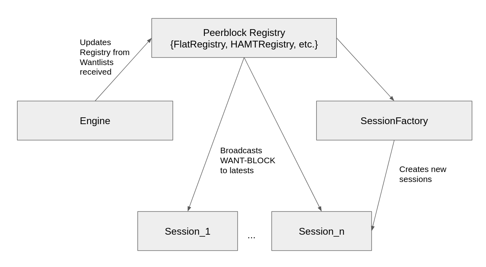

#  RFC|BB|L1-04: Track WANT messages for future queries
* Status: `Prototype`
* Implementation here: https://github.com/adlrocha/go-bitswap/tree/feature/rfcBBL104

## Abstract

This RFC proposes to leverage the knowledge acquired when receiving WANT messages sent by others in future requests issued by the peer tracking them. By keeping track of the WANT messages received, a peer will have the possibility to assert the likelihood of a peer having a block after a period of time, the rationale being: if someone asked for this in the past, they probably have it by now. With this information, a peer can issue queries to the peers that might have the block without having to enter in a discovery phase.

<!-- Full description here: https://docs.google.com/document/d/1zjJCZel8zJzgK3XuHK0YZlNffEHThq7tUOssGgRTryY/edit#heading=h.6qnrq913vou6 -->

## Shortcomings
Bitswap nodes currently send WANT messages blindly to all its connected peers. On the other hand, WANT messages include a lot of useful information about “recently accessed content” of a nodes’ connected peers. By tracking this information more directed and efficient searches of content can be performed.

## Description
Every time a peer requests content to the network it sends WANT requests to all its connected peers. A lot of information about the content being shared in our surroundings can be extracted from the reception of these requests. This proposal is based on the assumption that if a node is requesting content it potentially will store it in the near future.

With the implementation of this RFC, IPFS nodes will:
- Track all the WANT messages received and start building a “local view of the content”. We call this local view “peer-block registry” that is populated  with information about the CIDs and the peers that have recently requested them.
- With the creation of the registry above, we then use it as a new content routing-like service, in which we first lookup on the registry to see if the CID has been previously requested in “our surroundings”. If this is the case, we send a WANT-BLOCK message directly to that peer. This WANT-BLOCK is sent along with the WANT list.

With this simple scheme we are reducing to one the RTT required to request content previously accessed by my connected peers. Additionally, if applied to GraphSync, we can have a node fetch a file in one RTT by applying the selector in the CID

As a second phase of this RFC, we intend to increase the “view” of content, connected peers can periodically share their peer-blocks registry to populate them with more CIDs and peers, even if they are not connected to them. For this scheme we need to come up with ways of limiting the level of spread of “inspection tables” (or we may end up having an alternative DHT) such that maybe I only accept updates to my “inspection tables” from nodes 2-hops away. We also need ways to collect feedback and “garbage collect” outdated information from these tables (or it may end up being useless for a large amount of the requests).

Some of the known challenges to make this contribution efficient and effective are:
- Peers see potentially millions of WANT messages per day. The data structure containing this information should be compacted (e.g. using an accumulator) so that the overhead storing of it is low
- At the same time, seeking through this table must be fast as peers will need to query it for many blocks. The data structure should be both compact and fast to read.

Initial explorations indicated that an HAMT with an accumulator like approach are good candidates for this job.

## Implementation plan
- 🛠 Evaluate the use of HAMT and accumulators to easily access the peers from the structure that “potentially” has the CID.
    - [x] Do a test with 100K files of 1MB to see the number of Wants received by a single node.
    - 🛠 Show how naïve approaches may not work on the scale of decentralized. For this we will add a test in which we track the memory footprint of the two implementations of registries, the FlatRegistry and the HAMTRegistry for a large amount of files.
    - [x] Use HAMTRegistry as an efficient data structure for the registry.
    - ⚠ Current implementation of HAMTRegistry doesn’t include CHAMP modification.
    - [ ] Evaluate the use of accumulators to access registry entries and analyze how changing the size of the prefix in the accumulator structure used affects the bandwidth, memory footprint of peers, and the chance of finding discovery. This will allow us to put a ceiling to the number of entries to be tracked in the registry and its overhead.
- [x] Implement WANT inspection and design the data structure used to track the data being exchanged in requests.
- [x] Design protocol followed by peers to leverage this data structure to include information from it in its requests (sending an optimistic WANT-BLOCK in a Bitswap session to nodes in the table who have seen the desired CID before).
- [x] Implement some basic unit tests to be used throughout the development and enhancements over the RFC.
- [x] Design a test evaluation in the testbed (Waves test case included).
- ⚠ Design the garbage collections and exchange schemes for these tables.
   - FlatRegistry limits the maximum number of peers per CID allowed. For this Registry the garbage collection means cleaning the entries of outdated CIDs.
   - HAMTRegisry updates the key with the new list of peers. There is a maximum number of entries allowed in each key.
   - The garbage collection strategy will be defined according to the results of the memory footprint tests and the accummulator ceiling.

# Impact
We can expect the time to discover content in the network to be reduced.

## Evaluation Plan
- [The IPFS File Transfer Benchmarks](https://docs.google.com/document/d/1LYs3WDCwpkrBdfrnB_LE0xsxdMCIhXdCchIkbzZc8OE/edit#heading=h.nxkc23tlbqhl)
- [x] Create a test case that simulates the interest in a dataset by a growing population of nodes (e.g Use different waves of peers interested in a file). This will create the scenario in which the next wave will benefit from having the knowledge that the first wave might already have the file.
    - [ ] Include noise in the test case. Along with the regularly accessed files, nodes request random CIDs to pollute their registries.
    - [ ] Clear registries between run counts to remove advantage with files with similar blocks.
- [ ] Track memory footprint of peers.

## Results
The results for the implementation of this RFC were reported here: https://research.protocol.ai/blog/2020/two-ears-one-mouth-how-to-leverage-bitswap-chatter-for-faster-transfers/

## Future Work
- Protocol to share peer-block registries between nodes to increase “local views”.
- A good idea for reducing the scope of the content we keep track of is to somehow monitor the latency to the node and keep track of content that lives nearby.
- We can go further and think of budget-based forwarding schemes where nodes can forward only up to a fixed amount of requests. We’ve investigated several funky content discovery strategies in these two papers:
    - [On Demand Routing for Scalable Name Based Forwarding](http://conferences.sigcomm.org/acm-icn/2018/proceedings/icn18-final53.pdf)
    - [A Native Content Discovery Mechanism for Information-Centric Networks](https://www.ee.ucl.ac.uk/~ipsaras/files/efib-icn17.pdf)
