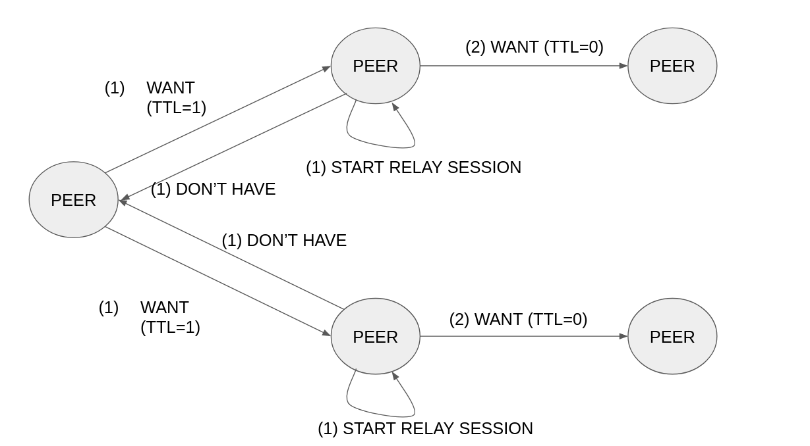
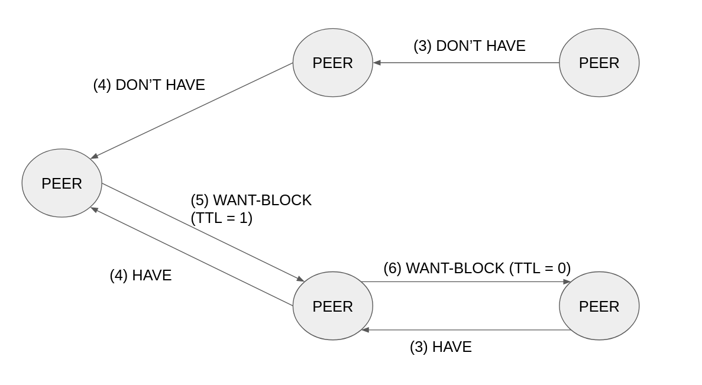
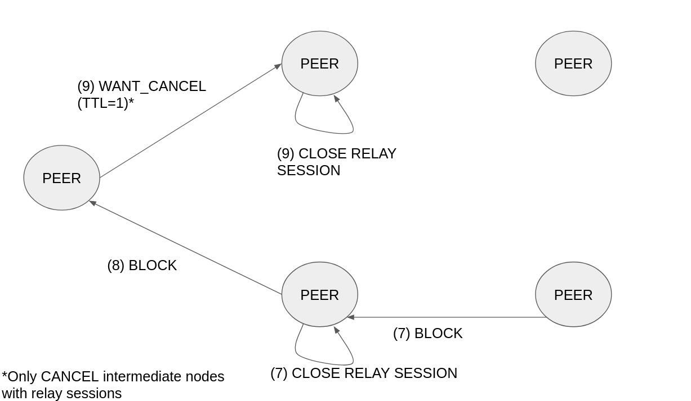

#  RFC|BB|L1-02: TTLs for rebroadcasting WANT messages
* Status: `Draft`
* Implementation here: https://github.com/adlrocha/go-bitswap/tree/feature/rfcBBL102

## Abstract

This RFC proposes setting a TTL on Bitswap WANT messages and TTL ceiling per node, in order to increase the chance of a node finding a provider that has the content without resorting to the DHT. This does mean that the WANT messages need to have an additional field of “requester” so that the receiving node knows who to dial to deliver a block.

<!-- Full description here: https://docs.google.com/document/d/1zjJCZel8zJzgK3XuHK0YZlNffEHThq7tUOssGgRTryY/edit#heading=h.6qnrq913vou6 -->

## Shortcomings

Bitswap only sends WANT messages to its directly connected peers. This limits the potential for finding the peer with the content to the peers directly connected to or the ones that result from a DHT query, which has its cost in time and connectivity.

## Description

The idea is to include a TTL to WANT messages. That way instead of forwarding WANT messages to our directly connected peers, we can increase the scope to, for instance, the connected peers of our connected peers (TTL=2). With this, we increase the span of discovery of content without having to resort to the DHT. This TTL needs to be limited to a small number to avoid flooding the network with WANT requests. It also complicates the implementation of the protocol, as now nodes need to track not only sessions from their directly connected peers but also from the ones x-hops away from them. Several design decisions would have to be made in the implementation such as the following (ideally the best value for these fields will be determined in testing. Additionally, we could set them to be dynamic according to the state of the network or the developer's desire. This will be explored in the future work).

-   Max TTL allowed. [This study proves](http://conferences2.sigcomm.org/acm-icn/2015/proceedings/p9-wang.pdf) that a Max TTL = 2 achieves the best performance (for moderately popular content) without severe impact in latency, so we can consider this as the baseline value. However, The impact and performance of this will depend heavily on how many connections each node maintains.

-   Forwarder of discovered blocks: Nodes x-hops away from the source of the requests can send responses following two approaches:

    -   Symmetric routing: Messages are forwarded to the requestor following the same path followed by the WANT messages.

    -   Asymmetric routing: Messages do not follow the same path followed by the WANT message, and responses are directly forwarded to its original requestor. In this alternative, nodes follow a "fire-and-forget approach" where intermediate nodes only act as relays and don't track the status of sessions, the receiving node X-hops away answer the requestor node directly, and the only one tracking the state of the session is the originating peer (and maybe the directly connected peers while the session has not been canceled, so that if they see any of the requested blocks it can notify its discovery). When implementing this approach we have to also bear in mind that establishing connections is an expensive process so in order for this approach to be efficient we should evaluate when it is worth for nodes to open a dedicated connection to forward messages back to the original requestor.

Initially, the protocol will be designed using symmetric routing, and will explore other routing alternatives in the future work. When exploring symmetric routing we need to bear in mind that according to IPFS values, nodes shouldn't push content to other peers that haven't requested it.

Again, this proposal should include schemes to avoid flooding attacks and the forgery of responses. It may be sensible to include networking information also in the request to allow easy discovery to forward responses X-hop away.

## Implementation plan
- [ ] Include TTL in WANT messages. Nodes receiving the WANT message track the session using indirect sessions, reduce in one the TTL of the WANT message and forward it to its connected peers. Duplicate WANT messages with lower or equal TTL should be discarded to avoid loops (higher TTLs could represent request updates). WANT sessions should be identified at least with the following tuple: {SOURCE, WANT_ID} so nodes know to whom it needs to send discovered blocks. (See figures below for the proposed implementation of the symmetric approach).

- [ ] Test the performance and bandwidth overhead of this scheme compared to plain Bitswap for different values of TTL.

- [ ] Evaluate the use of a symmetric and asymmetric routing approach for the forwarding of discovered blocks.

- [ ] Consider the implementation of "smart TTLs" in WANT requests, so according to the status of the network, bandwidth available, requests alive, number of connections or any other useful value, the TTL is determined.

### Symmetric approach message flows

# Impact
We should expect a latency reduction in the discovery of content but it may lead to an increase in the bandwidth overhead of the protocol. We do not expect the increase in the bandwidth overhead to be substantial, given that response messages are not big in size

## Evaluation Plan
-   [The IPFS File Transfer benchmarks.](https://docs.google.com/document/d/1LYs3WDCwpkrBdfrnB_LE0xsxdMCIhXdCchIkbzZc8OE/edit#heading=h.nxkc23tlbqhl)

-   Compare the times a node resorts to DHT according to the TTL used, and the bandwidth overhead due to control messages.

## Prior Work
This RFC was inspired by this proposal. The RFC is based on the assumption that DHT lookups are slow and therefore is better to increase our “Bitswap span” than resorting to the DHT. It would be great if we could validate this assumption before considering its implementation.

## Results

## Future Work
Some future work lines to consider:

-   Combine with RFC|BB|L1-04 so apart from setting a TTL to WANT messages, every peer receiving a WANT message tracks it in its peer-block registry enhancing also the discovery scope with peer-block registries tables.

-   With a very high number of connections the network is effectively flooded, which is not something we want. We could envision this technique as an efficient alternative to keeping many (questionable quality) connections. [[slides](http://conferences.sigcomm.org/acm-icn/2015/slides/01-01.pdf)]  

-   If we end up using request manifests as suggested in RFC | BB | L1/2-01, max TTLs could be specified in the exchange request message or determined according to the total connection of a peer to limit the network flooding. Even more, it'd be interesting to explore this RFC with RFC | BB | L1-06 so using GossipSub overlay network as a base, and according to scores and max connections of peers, WANT TTLs are determined.

-   Evaluate techniques used in GossipSub to fine-tune or enhance the use of WANT TTLs preventing the network from being flooded.
